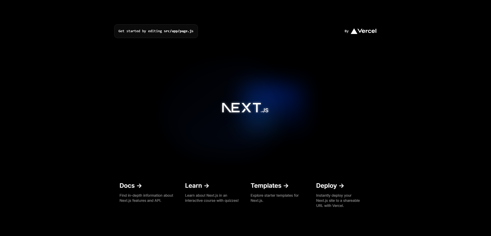

 

"[Next.js](https://nextjs.org/) is a React framework for building full-stack web applications. You use React Components to build user interfaces, and Next.js for additional features and optimizations."

This guide provides a first-hand experience on building a **Next.js** project with [Tailwind CSS](https://tailwindcss.com/) and deploying it on [GitHub Pages](https://pages.github.com/) using [GitHub Actions](https://github.com/features/actions).

## 🛠️ Installation

**1. Create your project.**

```bash
# terminal
npx create-next-app@latest
```

And answer the next prompts based on your project specification needs. <small>[reference here](https://nextjs.org/docs/getting-started/installation)</small>

```bash
What is your project named? project_name
Would you like to use TypeScript? No / Yes
Would you like to use ESLint? No / Yes
Would you like to use Tailwind CSS? No / Yes
Would you like to use `src/` directory? No / Yes
Would you like to use App Router? (recommended) No / Yes
Would you like to customize the default import alias (@/*)? No / Yes
```

**2. Start build process.**

```bash
# terminal
npm run dev
```

**3. Happy coding. ^^**

```jsx
<p className="text-red-400 font-bold mt-10">Tailwind is working.</p>
```

## 🗂️ File Structure

Sample project structure for reference.

```
my-nextjs-app/
├── public/
│ ├── images/
│ └── favicon.ico
├── src/
│ ├── components/
│ │ └── Header.js
│ ├── pages/
│ │ ├── api/
│ │ │ └── hello.js
│ │ └── index.js
│ ├── styles/
│ │ ├── globals.css
│ ├── utils/
│ │ └── helpers.js
│ └── hooks/
│ └── useExample.js
├── .gitignore
├── package.json
├── README.md
└── next.config.js
```

## 🛫 How to deploy to GitHub Pages

Deploying to github pages is totally up to you, be it through **[GitHub Actions](https://docs.github.com/en/actions/deployment/about-deployments/deploying-with-github-actions)**, or via **[gh-pages](https://www.npmjs.com/package/gh-pages)** package, or manually.

> [!NOTE]
>
> Also take note that [GitHub Pages](https://pages.github.com/) have limitations, it's free, yes, but it has a limit.

### ❗ via GitHub Actions in `Settings > Pages` ❗

**1. Modify src paths.**

```js
// page.js
<Image
  src="./vercel.svg"
  alt="Vercel Logo"
  className="dark:invert"
  width={100}
  height={24}
  priority
/>
```

**2. Modify `next.config.mjs` to enable static exports.** <small>[reference here](https://nextjs.org/docs/pages/building-your-application/deploying/static-exports)</small>

```js
/** @type {import('next').NextConfig} */
const nextConfig = {
  output: 'export',
};

export default nextConfig;
```

**3. Add `actions`.**

Use default action configuration from `Settings > Pages` or use the `.github/workflows/publish.yml` file.

**4. Visit your deployed site in `Settings > Page`. ^^**

### ❗ via manually configuring github pages settings ❗

**1. Create your project.**
Start coding your project, either use a framework like React, Vue, or not.

**2. Publish production build to GitHub.**
Push your _production build_ to your github repo. After that, check if your `index.html` file is uploaded, since it is one of the core files needed for your website to work.

**3. Configure your GitHub Pages on repo Settings.**
Navigate to `Settings > Pages > Build and deployment`. Make sure the **Source** says 'Deploy from a branch', and then configure the **Branch** settings and change it to your branch with the files.

---

### Learn More

To learn more about Next.js, take a look at the following resources:

- [Next.js Documentation](https://nextjs.org/docs) - learn about Next.js features and API.
- [Learn Next.js](https://nextjs.org/learn) - an interactive Next.js tutorial.

You can check out [the Next.js GitHub repository](https://github.com/vercel/next.js/) - your feedback and contributions are welcome!

### Deploy on Vercel

The easiest way to deploy your Next.js app is to use the [Vercel Platform](https://vercel.com/new?utm_medium=default-template&filter=next.js&utm_source=create-next-app&utm_campaign=create-next-app-readme) from the creators of Next.js.

Check out our [Next.js deployment documentation](https://nextjs.org/docs/deployment) for more details.

---

🌎 [kerbethecoder](https://kerbethecoder.com/)  
📫 krby.cnts@gmail.com  
📌 July 30, 2024
